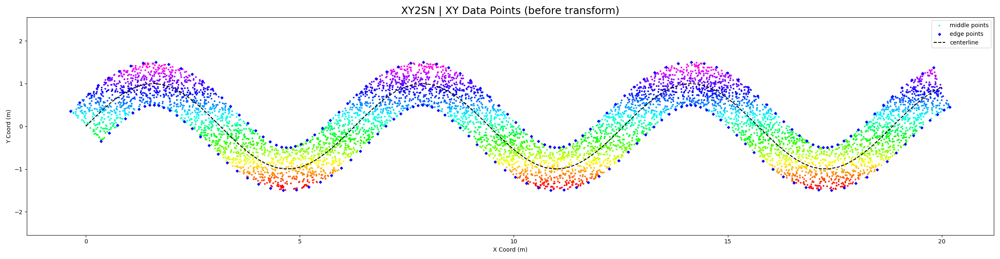
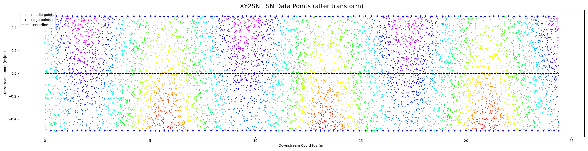
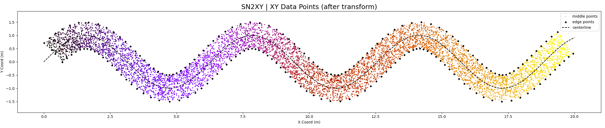

# py_streamNormalcoords
Stream Normal Coordinate Transformation
Compatibility:  Python 3.10

###### Change Log
* 2023 Feb 01 - swiched code structure to be function based, added 'reverse' transformations (sn2xy) to go from sn coords back to xy coords.

This code is based on an academic research article:
> Legleiter CJ, Kyriakidis PC. 2006. Forward and Inverse Transformation  between Cartesian and Channel-fitted Coordinate Systems for Meandering Rivers. Mathematical Geology 38 : 927–958. DOI: 10.1007/s11004-006-9056-6
>- The original source code from this article was in Matlab                 (acquired by Dietrich from Carl Legleiter, cjl@usgs.gov). This code is a translation of that original Matlab code with some added features/tweaks.
                
Given a digitized stream centerline and a set of input x,y coordinates. This software will transform the input x,y coordinates into a curvalinear coordinate system based on the stream centerline. This stream normal coordinate system is:
- **ds** - a downstream distance (from the most upstream point)
- **xs** - a cross-stream distance (an orthogonal distance to the centerline along the normal vector)

The reverse transofrmation is also possible.

### Demos
In the demo folder there are two(2) notebook files that show examples of the code in action.
### Data Prep
The inputs to the fuctions are arrays of points or pandas dataframes
##### Centerline Point (CL_pts)
X,Y points describing the centerline 

> a spatially variable search radii can be added by adding extra columns to the input centerline data and used in the fuctions
>>- downstream variable radii, but symmetric - 1-D Array
>>- downstream variable, but non-symmetric - 2-D Array 
>>	- Column 1 = left bank, Column 2 = right bank)
    
##### Data Point (data_pts)
X,Y data points to be transformed
- the order of the inputs is kept, so concatenating with point attributes should be easy

### To Run:
Ensure you have the following packages installed:
- scipy, numpy, pandas, matplotlib

#### Choose your Transformation Parameters for xy2sn
The transformation parameters are important, but require some trial and error. A lot will depend on what your initial point spacing is on your centerline and how tight your meander bends are.
###### Required
- nDiscr = number of segments to split the centerline into
	- a good place to start is your total length / desired segment length
- rMax   = maximum distance away from the centerline the code will search for points (see above how to make this spatially variable)

###### Optional
- nFilt  = number of filtering iterations (default is 5)
- order  = polynomial order of the filter (default is 3, `cubic` )
- window = number of points to include in the filter window (default is 5)

### More Theory (coming soon)
- More in-depth description of the process
- Overlapping search radii in sharp corners
	- Spatially variable rMax values helps
	- With Uniform RMax there is the possibility of overlapping cells
	- 
	- With Variable RMax there overlapping cells can be avoided
	- 
- Downstream distance variability as a function of transform parameters

## EXAMPLES
### XY2SN
Colors are based onthe Y-coordinates of the points
###### Regular Data Points

###### Random Data Points

### SN2XY
Colors are based onthe Downstream-coordinates of the points
###### Regular Data Points

###### Random Data Points

